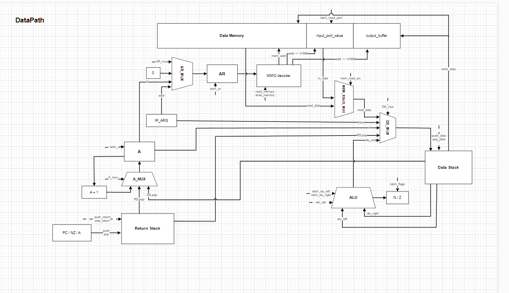
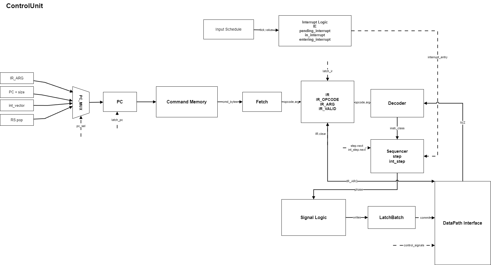

# SleekStack

Транслятор и модель стекового процессора для лабораторной работы ITMO CSA Lab4.

- Вариант: `alg | stack | harv | hw | tick | binary | trap | mem | cstr | prob2`.
- Основные модули: [translator.py](./translator.py), [machine.py](./machine.py), [isa.py](./isa.py).

SleekStack включает небольшой C-подобный язык, транслятор в бинарный машинный код и модель процессора с Гарвардской памятью, стековой ISA, memory-mapped I/O и вводом через прерывания по расписанию.

## Язык программирования

Программа состоит из глобальных переменных и функций. Выполнение начинается с `main`. Если в программе есть функция `trap`, транслятор записывает адрес этой функции в нулевую ячейку памяти данных: этот адрес используется как вектор обработчика прерывания.

```ebnf
program     ::= declaration*
declaration ::= "let" ident ("=" expression)? ";"
              | "def" ident "(" params? ")" block
params      ::= ident ("," ident)*
block       ::= "{" statement* "}"
statement   ::= declaration
              | block
              | "if" "(" expression ")" statement ("else" statement)?
              | "while" "(" expression ")" statement
              | "return" expression? ";"
              | expression ";"
expression  ::= assignment
assignment  ::= ident "=" assignment | equality
equality    ::= comparison (("==" | "!=") comparison)*
comparison  ::= term (("<" | "<=" | ">" | ">=") term)*
term        ::= factor (("+" | "-") factor)*
factor      ::= unary (("*" | "/") unary)*
unary       ::= "-" unary | call
call        ::= primary ("(" arguments? ")")*
arguments   ::= expression ("," expression)*
primary     ::= number | string | ident | "(" expression ")"
```

Семантика языка:

- вычисления выполняются строго слева направо;
- значения представлены 32-битными знаковыми словами;
- строковый литерал размещается в памяти данных как C-строка: по одному символу на слово, затем `0`;
- переменные бывают глобальными или локальными для функции; вложенные блоки новой области видимости не создают;
- `print(x)` и `puts(x)` печатают строку как C-строку, а число как одно значение;
- `putc(x)` пишет одно значение в порт вывода;
- `getc()` читает значение из порта ввода;
- `ei()`, `di()`, `iret()` транслируются в инструкции управления прерываниями.

## Организация памяти

Архитектура Гарвардская: память команд и память данных разделены и адресуются независимо.

| Область | Формат | Назначение |
|:--|:--|:--|
| Память команд | байты | бинарный машинный код |
| Память данных | 32-битные слова | глобальные и локальные переменные, строки, вектор прерывания |
| Стек данных | 32-битные слова | операнды стековой ISA |
| Стек возвратов | 32-битные слова | адреса возврата, сохранённое состояние при прерывании |

В памяти данных адрес `0` зарезервирован под вектор обработчика прерывания. Остальные статические данные размещает транслятор: сначала глобальные переменные, затем локальные переменные функций и строки. Стек данных и стек возвратов находятся внутри модели процессора и не занимают адреса в памяти данных.

Memory-mapped I/O:

| Адрес | Назначение |
|:--|:--|
| `31998` | порт ввода |
| `31999` | порт вывода |

Чтение из `31998` возвращает последнее значение, пришедшее из расписания ввода. Запись в `31999` добавляет значение в выходной буфер модели.

## Система команд

ISA стековая: арифметические и логические инструкции берут операнды со стека данных и кладут результат обратно на стек. Инструкции `load`, `store`, `a_load`, `a_load_+`, `a_store` работают с памятью данных; через те же операции доступны MMIO-порты.

### Набор инструкций

| Инструкция | Аргумент | Тактов | Описание |
|:--|:--|:--:|:--|
| `literal` | value | 2 | положить непосредственное значение на стек |
| `load` | addr | 3 | прочитать `mem[addr]` на стек |
| `store` | addr | 3 | записать вершину стека в `mem[addr]` |
| `stack_to_a` | - | 2 | загрузить регистр `A` из вершины стека |
| `a_to_stack` | - | 2 | положить значение `A` на стек |
| `a_load` | - | 3 | прочитать `mem[A]` на стек |
| `a_load_+` | - | 4 | прочитать `mem[A]` на стек, затем увеличить `A` |
| `a_store` | - | 3 | записать вершину стека в `mem[A]` |
| `add`, `sub`, `mul`, `div`, `mod` | - | 3 | бинарная арифметика |
| `increment`, `decrement` | - | 3 | изменить вершину стека на 1 |
| `inv`, `and`, `xor`, `or` | - | 3 | битовые операции |
| `lshift`, `rshift` | - | 3 | сдвиг вершины стека на один бит |
| `drop` | - | 2 | снять вершину стека |
| `dup` | - | 2 | продублировать вершину стека |
| `over` | - | 2 | поменять местами два верхних значения стека |
| `jmp` | addr | 2 | безусловный переход |
| `if` | addr | 3 | переход, если значение равно нулю |
| `mif` | addr | 3 | переход, если значение неотрицательное |
| `nif` | addr | 3 | переход, если значение не равно нулю |
| `call` | addr | 2 | вызов подпрограммы |
| `return` | - | 2 | возврат из подпрограммы |
| `r_to_top` | - | 2 | перенести вершину стека возвратов на стек данных |
| `top_to_r` | - | 2 | перенести вершину стека данных на стек возвратов |
| `ei`, `di` | - | 2 | разрешить или запретить прерывания |
| `iret` | - | 4 | восстановить состояние и выйти из обработчика прерывания |
| `halt` | - | 1 | остановить модель |

### Кодирование инструкций

Коды операций и правила сериализации находятся в [isa.py](./isa.py). Инструкция без аргумента занимает один байт. Инструкция с аргументом занимает пять байт: opcode и signed 32-bit big-endian аргумент.

```text
0x0005-0x0009 - 0x0600000002 - literal 2
```

Такой формат используется в листинге `program.lst`, который генерирует транслятор.

## Транслятор

Интерфейс:

```shell
python translator.py <input_file> <target_file>
```

Входной файл содержит программу на SleekStack. Выходные файлы создаются рядом с выбранным `target_file`:

- `<target_file>`: бинарный машинный код;
- `<target_file>.lst`: листинг памяти данных и команд;
- `<target_file>.config.json`: конфигурация модели процессора и начальный образ памяти данных;
- `<input_file>.ast`: текстовый дамп AST для отладки транслятора.

Основные этапы трансляции:

1. Лексический анализ.
2. Рекурсивный спуск по грамматике.
3. Статическое размещение переменных и строк в памяти данных.
4. Генерация стекового машинного кода.
5. Разрешение адресов переходов и вызовов.
6. Запись бинарного кода, листинга и конфигурации модели.

Пример:

```shell
python translator.py examples/euler6.ss out.bin
```

## Модель процессора

Интерфейс:

```shell
python machine.py <code.bin> <config.json> [schedule.txt] [log.txt] [--log log.txt]
```

Модель загружает бинарный код, конфигурацию памяти данных и, при необходимости, расписание ввода. На stdout выводится итоговый буфер вывода и количество тактов. Если указан файл журнала, в него записывается состояние после каждого такта.

Формат расписания ввода:

```text
<tick> <token>
```

Когда наступает указанный такт, значение защёлкивается во входной порт `31998`, а ControlUnit получает запрос прерывания.

### DataPath



DataPath содержит:

- регистр косвенной адресации `A`;
- адресный регистр памяти данных `AR`;
- ALU с регистрами `left`, `right`, `out` и флагами `N`, `Z`;
- стек данных `DS` и стек возвратов `RS`;
- память данных и MMIO-порты;
- входной порт и выходной буфер.

Память данных однопортовая: в один такт моделируется либо чтение, либо запись. Операции с памятью проходят через `AR`, поэтому в журнале видно отдельные шаги адресации и чтения/записи.

### ControlUnit



ControlUnit является hardwired: поведение инструкций задано логикой модели, без памяти микрокода. Он хранит `PC`, регистр инструкции `IR`, номер микрошагa `STEP`, состояние прерываний и формирует сигналы для DataPath.

Выборка инструкции вынесена в отдельный такт: байты читаются из памяти команд по `PC`, затем opcode и аргумент попадают в `IR`. На следующих тактах выполняются микрошаги инструкции. Запланированные защёлки применяются одновременно в конце такта, поэтому зависимые действия видят новое значение только на следующем такте.

При входе в прерывание модель сохраняет `PC`, статус `NZ` и `A` в стек возвратов, читает вектор из `mem[0]` и загружает адрес обработчика в `PC`. `iret` восстанавливает сохранённое состояние, разрешает прерывания и возвращает выполнение в основную программу.

### Журнал выполнения

Каждая строка `trace.log` фиксирует наблюдаемое состояние модели после такта: `TICK`, `PC`, `STEP`, `IR`, регистры, флаги, состояние прерываний, стеки, действие памяти, список сработавших защёлок и текущий выходной буфер.

Пример печати символа через косвенное чтение строки и запись в MMIO-порт:

```text
TICK: 000008 | PC: 00017 | STEP: 0 | IR: a_load_+    | ... | LATCH: IR                | fetch a_load_+
TICK: 000009 | PC: 00017 | STEP: 1 | IR: a_load_+    | ... | LATCH: AR                | aload.addr
TICK: 000010 | PC: 00017 | STEP: 2 | IR: a_load_+    | ... | MEM: read mem[1]         | LATCH: DS.push
TICK: 000019 | PC: 00029 | STEP: 0 | IR: store 31999 | ... | MEM: write mem[31999] <- 72 | OUT: 'H'
```

Пример входа в обработчик прерывания:

```text
TICK: 000100 | PC: 00116 | IR: ----       | IE: 0 | IN_INTR: 1 | LATCH: IN_PORT,RS.push(PC) | INT ENTRY: push PC
TICK: 000104 | PC: 00116 | IR: ----       | IE: 0 | IN_INTR: 1 | MEM: read mem[0]            | INT ENTRY: read vector
TICK: 000105 | PC: 00031 | IR: ----       | IE: 0 | IN_INTR: 1 | LATCH: PC                   | INT ENTRY: PC <- vector
TICK: 000108 | PC: 00036 | IR: load 31998 | IE: 0 | IN_INTR: 1 | MEM: read mem[31998]        | load.read
```

Полные журналы лежат в golden fixtures, например [golden/hello/trace.log](./golden/hello/trace.log) и [golden/cat/trace.log](./golden/cat/trace.log).

## Тестирование

Golden tests находятся в [tests/test_golden.py](./tests/test_golden.py), эталоны - в каталоге [golden](./golden). Каждый тест заново транслирует исходную программу во временный каталог, запускает модель и сравнивает результат с сохранёнными эталонами.

Покрытые программы:

| Тест | Что проверяет |
|:--|:--|
| [hello](./golden/hello/manifest.json) | печать `Hello, world!` |
| [cat](./golden/cat/manifest.json) | ввод через `trap` и посимвольный вывод |
| [hello_user_name](./golden/hello_user_name/manifest.json) | запрос имени и приветствие |
| [sort](./golden/sort/manifest.json) | чтение трёх символов-чисел и сортировка |
| [double_precision](./golden/double_precision/manifest.json) | пример двухсловной арифметики |
| [euler6](./golden/euler6/manifest.json) | алгоритм варианта, Project Euler problem 6 |
| [features](./golden/features/manifest.json) | функции, вызовы, возврат и ветвление |

В каждом каталоге golden test хранит:

- `source.ss`: исходную программу;
- `input.schedule`, если тест использует ввод;
- `program.bin`: ожидаемый бинарный код;
- `program.lst`: листинг памяти данных и команд;
- `config.json`: конфигурацию модели и образ памяти данных;
- `trace.log`: полный журнал выполнения;
- `stdout.txt`: ожидаемый stdout модели;
- `manifest.json`: имя теста, ожидаемый вывод, число тактов и SHA-256 артефактов.

Запуск проверок:

```shell
python -m py_compile translator.py isa.py machine.py
python -m unittest tests.test_golden -v
```

Перегенерация эталонов после намеренного изменения транслятора или модели:

```shell
python tests/update_golden.py
```

Пример ручного запуска:

```shell
python translator.py examples/euler6.ss out.bin
python machine.py out.bin out.bin.config.json --log out.log
```
